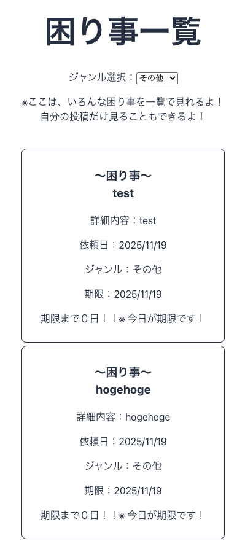
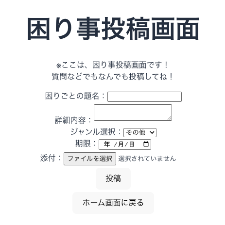

# プロジェクト名：komado(困り事相談窓口アプリ)

## １アプリ概要

"komado"は、デジタル化が進む工場などへのデジタル製品の導入に伴うデジタル難民からデジタル大臣まで幅広く、
困り事を通じて繋げてくれる相互支援アプリケーションです。
デジタル難民の方の困り事などを匿名性の掲示板を使い、
デジタル大臣を含むみんな助け合い解決する仕組みを提供します。

## 主な機能

- 困りごとの投稿機能
- 期限設定と様々なジャンル設定機能
- みんなの困りごと一覧表示機能
- ジャンル別一覧表示機能

## 対応プラットフォーム

- Windows
- macOS
- Linux
- ブラウザが使える環境ならばなんでも！

## 使用技術一覧

<!-- シールド一覧 -->
<!-- 該当するプロジェクトの中から任意のものを選ぶ-->

<フロント>

<br>
<サーバ>


<br>
<データベース>

<br>
<デプロイメント>


## インストール手順

### 必要な環境

- 特に指定なし

### インストール手順

1. ディレクトリに移動

   ```
   cd && mkdir /MyApp && cd /MyApp
   ```

2. このリポジトリをクローン　 ➡️

   ```
   https://github.com/shuusuke441/solo_full_stack#
   ```

3. 環境から実行まで自動化スクリプト

   ```
   npm run build && npm run db:migrate
   ```

4. アプリを実行(ローカル環境で動かせる)
   ```
   npm run dev && npm run start
   ```

## package.json の中身について

back 側

```"scripts": { "
    "start": "node server.js ", :　server.jsを起動
    "dev": "nodemon server.js",　:サーバーを自動更新してくれる
    "build": "npm install && cd ../front && npm install && npm run build && rm -rf ../back/　public && cp -r dist ../back/public",　: フロントとバックにnode-modulesをインストールし、バックエンド側のpublicにフロントのjsとCSSを格納
    "db:migrate": "knex migrate:latest",　: 最新のマイグレーションのバージョンに更新
    "db:migrate-make": "knex migrate:make",　: マイグレーションを作成
    "db:seed": "knex seed:run",　: シードファイルを読み込む
    "db:seed-make": "knex seed:make",　: シードファイルを作成
    "db:migrate-roll": "knex  migrate:rollback --all",　: マイグレーションのバージョンをロールバックする
    "db:reset": "knex migrate:rollback --all && knex migrate:latest && knex seed:run"　: マイグレーションを全てロールバックして、最新のマイグレーションに更新し、シードファイルを読み込む
  },
```

front 側

```
  "scripts": {
    "dev": "vite",　:　viteを起動
    "build": "vite build",　: distフォルダを作成
    "lint": "eslint .",　: eslintを起動(バグを修正するツール)
    "preview": "vite preview" : Viteでビルドされたアプリケーションの最終的な成果物をローカル環境でプレビューするためのコマンド
  },
```

## 貢献方法

このプロジェクトへの貢献を歓迎します！以下の手順で貢献が可能です。

### 1. バグ報告・機能リクエスト

- GitHub の [Issues](https://github.com/yourusername/MyProject/issues) で報告してください。

### 2. コードの貢献

1. リポジトリをフォークする
2. 新しいブランチを作成

   ```
   git checkout -b feature-branch
   ```

3. 変更を加えてコミット

```
git commit -m "新機能を追加"
```

4. プルリクエストを送信する

### 3. コーディングガイドライン

- コードの可読性を保つため、コードフォーマッターの　 prettier をご使用ください。　
  初期設定のままで結構ですが、
  念の為、下記の設定に変更してください。

## インストール方法

### 1. 右のコマンドをターミナルで入力してください。

```
npm i -D prettier
```

### 2 . スクリプトを package.json に追加

- package.json ファイルに Prettier を実行するスクリプトを追加します。

```

{
"scripts": {
"format": "prettier --write ."
}
}

```

- これにより、npm run format コマンドでプロジェクト全体のコードをフォーマットできるようになります。

### 3. Prettier の設定ファイルを作成

プロジェクトのルートディレクトリに .prettierrc というファイルを作成し、以下の内容を追加します。

```

{
"bracketSpacing": true,
"semi": true,
"singleQuote": true,
"useTabs": false
}

```

この設定は以下を意味します：

bracketSpacing: true: オブジェクトリテラルの括弧内にスペースを入れる ({ foo: bar })。
semi: true: ステートメントの最後にセミコロンを付ける。
singleQuote: true: 文字列リテラルにシングルクォートを使用する。
useTabs: false: インデントにタブではなくスペースを使用する。

### 4. .prettierignore ファイルを作成

- プロジェクトのルートディレクトリに .prettierignore というファイルを作成し、フォーマットの対象外にしたいファイルやディレクトリを指定します。例えば、以下のように設定します。

```

node_modules
build
dist

```

### 5. フォーマットの実行

- 設定が完了したら、プロジェクトのルートディレクトリで以下のコマンドを実行することで、npm run format を使ってプロジェクト全体のコードをフォーマットできます

```
npm run format
```

## アプリの画面

- 以下の画像は、本アプリの home 画面です。


- 次の画像は、サンプルデータの入った一覧画面です。



- 次の画像は、ユーザーが困り事を投稿する画面です。



## 今後の展望

このアプリケーションでは、チャット機能でその場その場で困りごとの解決など、さらには、
ユーザー一人ひとりにログインしていただき、困りごとの一覧表示画面では、
ユーザ自身の投稿のみ見えるようにするなど。
様々な機能をつけて UX の向上を図りたい。

また、
個人タスク管理画面についても実装し、
タイマー機能など、タスクを実施した際にかかった時間など、
学習時間の見える化を行い、学習のモチベーションにできるアプリにしたいと思っております。
